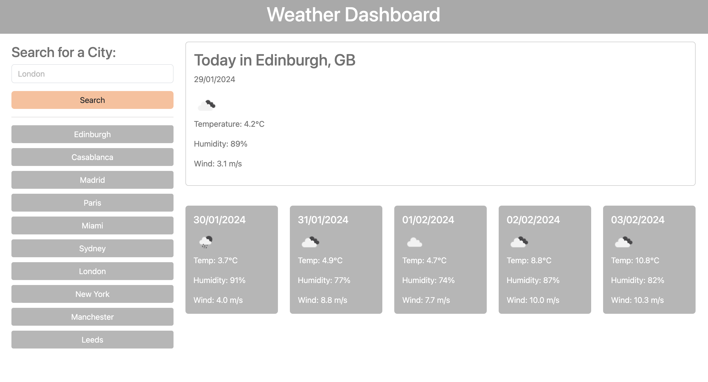

# Challenge 8 Server-Side APIs: Weather Dashboard

## Description

The Weather Dashboard is a web application that provides real-time weather updates for various cities. It utilises the OpenWeatherMap API to retrieve weather data and dynamically updates the HTML and CSS for an interactive experience.

### Motivation

The motivation behind this project is to enable travellers to check the current and upcoming weather conditions for multiple cities, assisting in travel planning and preparations.

### Features

Dynamic Weather Updates: Leverages the 5 Day Weather Forecast API to fetch and display weather data for searched cities.

Search Functionality: Users can search for a city and view its current weather conditions and 5-day forecast.

Search History: Maintains a search history for quick access to previously 10 searched cities.

Persistent Data: Utilises 'localStorage' to store search history even after the browser is refreshed.

Responsive Design: Ensures a seamless experience across various devices and screen sizes.

### Technologies Used

HTML,CSS, JavaScript, OpenWeatherMap API, Bootstrap

## User Story

AS A traveler
I WANT to see the weather outlook for multiple cities
SO THAT I can plan a trip accordingly

## Usage

To use the Weather Dashboard, simply enter the name of a city into the search input. The dashboard will present the current weather conditions and a 5-day forecast. Clicking on a city in the search history will quickly bring up the weather details for that location again. 

### Deployment

This application is deployed at a live URL and is accessible for public use:

[Link to the deployed Weather Dashboard Application](https://natt5.github.io/challenge8-server-api-weather-dashboard/)

### GitHub Repository

[Link to the GitHub repository for the Weather Dashboard Application](https://github.com/Natt5/challenge8-server-api-weather-dashboard)

## Credits

The following resources were instrumental in this project’s completion:

[Bootstrap v5.3.0-alpha3. Bootstrap's comprehensive library](https://getbootstrap.com)

[Coding Boot Camp: Professional README Guide](https://coding-boot-camp.github.io/full-stack/github/professional-readme-guide)

[Full-Stack Blog on how to use API keys](https://coding-boot-camp.github.io/full-stack/apis/how-to-use-api-keys).

[How to save localStorage only on click](https://stackoverflow.com/questions/61105569/how-to-save-localstorage-only-on-click)

[jQuery API Documentation: JavaScript library.](https://api.jquery.com)

[MDN Web Docs](https://developer.mozilla.org/en-US/docs/Web/API)

[OpenWeatherMap API](https://openweathermap.org/guide)

## License

Refer to the LICENSE in the repo.

## Badges

